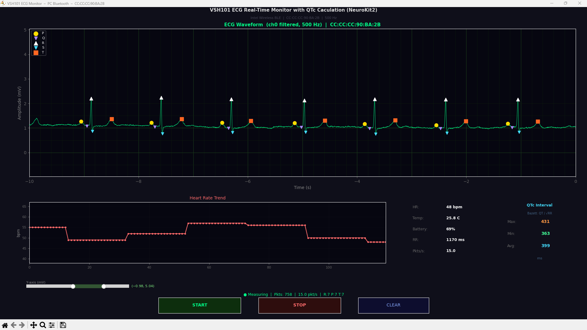

# VSH101 ECG Real-Time Monitor with QTc Calculation (NeuroKit2)

A Python application for real-time ECG acquisition, waveform visualization, and cardiac interval analysis from the **VitalSigns Technology VSH101 1-Lead Holter** device using PC Bluetooth (BLE).

This project extends the base VSH101 BLE monitor with **real-time PQRST peak detection** powered by [NeuroKit2](https://github.com/neuropsychology/NeuroKit), and computes the **QTc interval** (Bazett correction) beat-by-beat from the live ECG stream.

---

## Features

- **BLE direct connection** — no dongle required, uses the PC's built-in Bluetooth adapter
- **Auto-scan & device selection** — automatically discovers nearby VSH101 devices on startup
- **Real-time ECG waveform** — 10-second scrolling display at 500 Hz
- **PQRST peak detection** — live P, Q, R, S, T peak markers overlaid on the ECG waveform (NeuroKit2)
- **QTc interval (Bazett)** — beat-by-beat QT correction with Max / Min / Average display
- **Y-axis range slider** — interactive adjustment of ECG amplitude display range
- **Heart Rate trend chart** — live HR history plot
- **Vital signs panel** — Heart Rate, Temperature, Battery, RR Interval, packet rate
- **Start / Stop / Clear buttons** — full control of measurement from the GUI
- **ACK-verified command flow** — each BLE command is confirmed before proceeding
- **Demo mode** — simulate ECG without hardware for testing

---

## Screenshot

> VSH101 ECG Real-Time Monitor with QTc Calculation (NeuroKit2) — 10-second scrolling waveform at 500 Hz, with PQRST peak markers and QTc interval panel.



| Panel | Description |
|-------|-------------|
| **ECG Waveform** | 10-second scrolling display, ch0 filtered, 500 Hz |
| **Peak Markers** | P (yellow ●), Q (purple ▼), R (white ▲), S (cyan ▼), T (orange ■) |
| **QTc Panel** | Bazett-corrected QT: Max / Min / Avg in ms |
| **Heart Rate Trend** | Live HR history (bpm) updated every 200 ms |
| **Status Panel** | HR, Temperature, Battery SOC, RR Interval, packet rate |
| **Y-axis Slider** | Drag handles to zoom ECG amplitude in real time |

---

## Demo

> VSH101 ECG Real-Time Monitor with QTc Calculation (NeuroKit2) — 6-minute recording

[](https://youtu.be/MkLWXpBy73A "VSH101 ECG Real-Time Monitor with QTc Calculation (NeuroKit2)")

---

## Hardware Requirements

| Item | Details |
|------|---------|
| **VSH101** | VitalSigns Technology 1-Lead Holter ECG device |
| **PC Bluetooth** | BLE 4.0+ adapter (Intel Wireless Bluetooth or equivalent) |
| **OS** | Windows 10/11, macOS, Linux |

---

## BLE Protocol

The VSH101 uses the **Nordic UART Service (NUS)**:

| Role | UUID |
|------|------|
| Service | `6e400001-b5a3-f393-e0a9-e50e24dcca9e` |
| Write (PC → device) | `6e400002-b5a3-f393-e0a9-e50e24dcca9e` |
| Notify (device → PC) | `6e400003-b5a3-f393-e0a9-e50e24dcca9e` |

---

## Installation

### 1. Prerequisites

- Python 3.10 or newer

### 2. Install dependencies

```bash
pip install bleak matplotlib numpy neurokit2
```

| Package | Purpose |
|---------|---------|
| `bleak` | Cross-platform BLE communication |
| `matplotlib` | Real-time ECG waveform plotting and interactive widgets |
| `numpy` | ECG signal processing and array operations |
| `neurokit2` | PQRST peak detection and ECG delineation |

### 3. Download the script

```bash
git clone https://github.com/imleonchuang/VSH101_Peaks.git
cd VSH101_Peaks
```

Or download `VSH101_Peaks.py` directly.

---

## VSH101 Device Setup

1. **Power on** — press and hold the button for 5 seconds until the **green LED blinks**
2. **BLE advertising** — the device starts advertising automatically after power-on
3. **Electrode placement** — attach the ECG electrodes to the device following the VSH101 manual
4. **Range** — keep the device within **1 metre** of the PC during initial connection

---

## Usage

### Auto-scan (recommended)

```bash
python VSH101_Peaks.py
```

The program will:
1. Scan for nearby VSH101 devices (6 seconds)
2. If one device is found → connect automatically
3. If multiple devices are found → display a numbered list and prompt for selection

```
[12:34:56.001] [SCAN] Scanning 6s for BLE devices (PC Bluetooth)...
[12:34:57.123]   VSH101_JL_DBG               CC:CC:CC:90:BA:2B  RSSI:  -55  <-- VSH101
[12:34:57.124]   VSH101_JL_REL               DD:DD:DD:11:22:33  RSSI:  -72  <-- VSH101

Multiple devices found, please choose:
  [0] VSH101_JL_DBG           (CC:CC:CC:90:BA:2B)
  [1] VSH101_JL_REL           (DD:DD:DD:11:22:33)
Enter index to connect: 0
```

### Direct connect via MAC address

```bash
python VSH101_Peaks.py --mac CC:CC:CC:90:BA:2B
```

### Scan only (list devices without connecting)

```bash
python VSH101_Peaks.py --scan-only
```

### Demo mode (no hardware needed)

```bash
python VSH101_Peaks.py --demo
```

Generates a synthetic PQRST waveform for UI testing. Peak detection and QTc calculation work in demo mode.

### All options

```
usage: VSH101_Peaks.py [-h] [--mac MAC] [--type {0,1}]
                       [--scan-only] [--scan-timeout SCAN_TIMEOUT] [--demo]

optional arguments:
  --mac MAC                  VSH101 BLE MAC address (omit to trigger auto-scan)
  --type {0,1}               VSC Mode: 0=2ch/968B  1=1ch/568B (default: 1)
  --scan-only                Scan for VSH101 devices and exit
  --scan-timeout SECONDS     Scan duration in seconds (default: 6)
  --demo                     Simulate ECG without hardware
```

---

## GUI Controls

| Control | Action |
|---------|--------|
| **START** | Begin ECG measurement — sends VSC Mode commands and starts data streaming |
| **STOP** | Pause measurement — sends VSC Mode Stop to device |
| **CLEAR** | Clear ECG waveform, peak markers, HR history, and QTc values |
| **Y-axis slider** | Drag left/right handles to adjust ECG amplitude display range (−5 to +5 mV) |

---

## PQRST Peak Detection

Peak detection is implemented in the `EcgDelineator` class using **NeuroKit2**,  
following the approach described in the [NeuroKit2 ECG Delineation documentation](https://neuropsychology.github.io/NeuroKit/examples/ecg_delineate/ecg_delineate.html).

### How it works

```
ECG Buffer (10 s / 5000 samples)
        │
        ▼
nk.ecg_peaks()          ← Step 1: R-peak detection (method="neurokit")
        │
        ▼
nk.ecg_delineate()      ← Step 2: PQST delineation (method="peak")
        │
        ▼
Peak indices (P, Q, R, S, T)  →  scatter markers on ECG plot
        │
        ▼
QTc calculation (Bazett)      →  QTc Max / Min / Avg panel
```

### NeuroKit2 API used

```python
# Step 1: R-peak detection
_, rpeaks_dict = nk.ecg_peaks(ecg_window,
                               sampling_rate=500,
                               method="neurokit")

# Step 2: PQST delineation
_, waves = nk.ecg_delineate(ecg_window, rpeaks_dict,
                             sampling_rate=500,
                             method="peak")

# Extract peaks
p_peaks = waves["ECG_P_Peaks"]    # may contain NaN where undetected
q_peaks = waves["ECG_Q_Peaks"]
r_peaks = rpeaks_dict["ECG_R_Peaks"]
s_peaks = waves["ECG_S_Peaks"]
t_peaks = waves["ECG_T_Peaks"]
```

### Peak marker colors on waveform

| Peak | Marker | Color | Clinical meaning |
|------|--------|-------|-----------------|
| **P** | ● circle | Yellow `#FFDD00` | Atrial depolarization |
| **Q** | ▼ triangle | Purple `#AA88FF` | Start of ventricular depolarization |
| **R** | ▲ triangle | White `#FFFFFF` | Peak of ventricular depolarization |
| **S** | ▼ triangle | Cyan `#44DDFF` | End of ventricular depolarization |
| **T** | ■ square | Orange `#FF6622` | Ventricular repolarization |

### Design considerations

- **Non-blocking**: delineation runs in a **daemon thread** so it never blocks the 200 ms animation update
- **Busy flag**: only one delineation thread runs at a time; new frames skip if the previous run has not finished
- **Minimum window**: requires at least **4 seconds** (2000 samples) before detection starts — ensures at least 2 complete RR intervals for reliable delineation
- **NaN removal**: NeuroKit2 returns `NaN` where a peak cannot be found; these are stripped before plotting

---

## QTc Interval — Bazett Formula

The **QTc interval** corrects the raw QT interval for heart rate, making it comparable across different HR values.

### Formula

$$QTc = \frac{QT}{\sqrt{RR}}$$

| Symbol | Definition | Unit |
|--------|-----------|------|
| **QT** | Q-onset (or R-peak if Q absent) → T-peak | ms |
| **RR** | R-to-R interval of the **preceding beat** | seconds |
| **QTc** | Heart-rate-corrected QT (Bazett, 1920) | ms |

### Implementation

```python
# RR intervals in seconds (between consecutive R-peaks)
rr_intervals_s = np.diff(r_peaks) / SAMPLE_RATE   # 500 Hz

for beat_idx, r_idx in enumerate(r_peaks):
    # Use preceding RR for this beat (first beat uses following RR)
    rr_s = rr_intervals_s[beat_idx - 1] if beat_idx > 0 else rr_intervals_s[0]

    # Find T-peak within 0–65% of RR after this R
    t_candidates = t_peaks[(t_peaks > r_idx) &
                            (t_peaks < r_idx + rr_s * SAMPLE_RATE * 0.65)]
    t_idx = t_candidates[0]   # nearest T-peak

    # Use Q-peak onset if detected within 25% of RR before R
    onset_idx = q_peaks[q_peaks < r_idx][-1]   # or fallback to r_idx

    # QT in ms
    qt_ms = ((t_idx - onset_idx) / SAMPLE_RATE) * 1000.0

    # Bazett correction
    qtc = qt_ms / np.sqrt(rr_s)
```

### Validity filters

| Check | Range | Reason |
|-------|-------|--------|
| QT sanity | 200–600 ms | Exclude noise and mis-detected beats |
| QTc sanity | 250–700 ms | Exclude physiologically impossible values |
| T-peak search window | 0–65% of RR | Prevent cross-beat T-peak assignment |
| Q-peak search window | 0–25% of RR before R | Prevent cross-beat Q-peak assignment |

### Displayed statistics (updated every 200 ms)

| Statistic | Description |
|-----------|-------------|
| **Max** | Longest QTc in the current 10-second window |
| **Min** | Shortest QTc in the current 10-second window |
| **Avg** | Mean QTc across all valid beats in the window |

### Clinical reference ranges

| Classification | Male | Female |
|---------------|------|--------|
| Normal | < 440 ms | < 450 ms |
| Borderline | 440–460 ms | 450–470 ms |
| Prolonged (Long QT) | > 460 ms | > 470 ms |

> **Note:** This tool is intended for research and educational purposes only and is not a medical device.

---

## Communication Flow

After pressing **START**, the program follows the official VSH101 command sequence:

```
Step 1  Version Get       →  reads firmware version string from device
Step 2  VSC Type Set      →  sets VSC Mode Type 1 (1-channel, 568 B/packet)
Step 3  VSC Mode START    →  device begins buffering ECG samples
Step 4  VSC Mode READ     →  polls ECG data every 200 ms (500 Hz, 100 samples/packet)
Step 5  VSC Mode STOP     →  stops streaming (on STOP button or window close)
```

Each of Steps 1–3 and 5 waits for a BLE ACK notification from the device before proceeding. If an ACK is not received within 3 seconds, the sequence is **aborted** and an error is displayed in the GUI.

### Packet structure (VSC Mode Read response, Type 1)

```
Byte offset   Field
──────────────────────────────────────────────
0             PCode  (0x6A)
1             Group  (0xC2)
2             Ack    (0x41 = 'A' = OK)
3             ChkSum
4–5           Index  (uint16 LE)
6–7           Length (uint16 LE)
8–407         ECG data: 100 × float32 (ch0, filtered, mV)
408–575       INFO data: 42 × float32
              [2]  Temperature (°C)
              [3]  Heart Rate (bpm)
              [4]  Lead-off flag
              [8]  Battery SOC (%)
              [13] RR Interval (ms)
```

---

## VSC MODE Commands — Detailed Reference

All packets share the same **8-byte header + 16-byte parameter** structure.
The checksum covers every byte in the packet: `ChkSum = sum(all_bytes) % 256`.

### General Packet Format

```
Offset  Size  Field       Description
──────────────────────────────────────────────────────────────────
0       1 B   PCode       Command code (identifies the command)
1       1 B   Group       Command group (0xC0 = system, 0xC2 = VSC)
2       1 B   Cmd / Ack   TX: same as PCode  |  RX: 0x41=OK / 0x4E=fail
3       1 B   ChkSum      sum(all bytes in packet) % 256
4       2 B   MOSI_LEN    Bytes sent TO device (Little Endian)
6       2 B   MISO_LEN    Bytes expected FROM device (Little Endian)
8      16 B   Param       Parameter field (command-specific, zero-padded)
24+     N B   CmdData     Optional payload (command-specific)
```

### VSC Command Quick Reference

| Step | Command | PCode | Group | MOSI | MISO | ACK len | Abort on fail |
|------|---------|-------|-------|------|------|---------|---------------|
| 1 | Version Get | `0x00` | `0xC0` | 0 B | 32 B | **40 B** | No |
| 2 | VSC Type Set | `0x70` | `0xC2` | 4 B | 0 B | **8 B** | **Yes** |
| 3 | VSC Mode START | `0x64` | `0xC2` | 0 B | 0 B | **8 B** | **Yes** |
| 4 | VSC Mode READ | `0x6A` | `0xC2` | 0 B | 568/968 B | **576/976 B** | No (retry) |
| 5 | VSC Mode STOP | `0x65` | `0xC2` | 0 B | 0 B | **8 B** | No |

> All commands use `write_gatt_char(..., response=True)` (ATT Write Request).
> The device sends its ACK/response via BLE Notify on `6e400003-...`.

---

## Console Output

A typical successful startup looks like:

```
[12:34:56.001] [SCAN] Scanning 6s for BLE devices...
[12:34:57.123]   VSH101_JL_DBG    CC:CC:CC:90:BA:2B  RSSI: -55  <-- VSH101
[12:34:57.124] [MAIN] Automatically selected: VSH101_JL_DBG (CC:CC:CC:90:BA:2B)
[12:34:58.500] [BLE] Connected!
[12:34:58.600] [BLE] Notifications enabled

--- press START in the GUI ---

[12:35:01.000] [TX]  Version Get       (24B): 00c000e0...  sent OK
[12:35:01.050] [ACK] Version Get       OK  PCode=00 Group=C0 Ack=41 (40B)
[12:35:01.051] [VERSION] | VSH101 Firmware : VSH101_43  |

[12:35:01.100] [TX]  VSC Type Set (1)  sent OK
[12:35:01.150] [ACK] VSC Type Set (1)  OK

[12:35:01.200] [TX]  VSC Mode START    sent OK
[12:35:01.250] [ACK] VSC Mode START    OK

[12:35:01.300] [VSC] Streaming ECG  (press STOP to stop)...
[12:35:01.300] [TX]  VSC Mode READ  index=0  sent OK
[12:35:01.500] [ACK] VSC Mode READ  index=0  OK
● Measuring  |  Pkts: 150  |  5.0 pkt/s  |  R:12 P:11 T:11
```

---

## Troubleshooting

### No devices found during scan

- Ensure VSH101 is powered on (green LED must be blinking)
- Ensure the PC Bluetooth adapter is enabled
- Move the device closer to the PC (within 1 m)
- Try increasing scan time: `--scan-timeout 15`

### BLE connection fails

- Another application may already be connected — close it first
- Try power-cycling the VSH101 (hold button until LED turns off, then power on again)

### ACK timeout after START

- The device may have gone to sleep — power cycle and reconnect
- Check that electrodes are attached before starting measurement

### Peak markers not appearing

- Markers appear only after **4 seconds** of ECG data have been collected (minimum window for NeuroKit2)
- Check the status bar for `R:0 P:0 T:0` — if counts remain zero, the signal may be too noisy or lead-off

### QTc shows `--`

- QTc requires both R-peaks and T-peaks to be successfully detected
- Ensure good electrode contact (lead-off flag must be 0)
- Wait at least 4–5 seconds after START before QTc values appear

### `ModuleNotFoundError: No module named 'neurokit2'`

```bash
pip install neurokit2
```

### `matplotlib` window does not appear (Linux)

```bash
sudo apt-get install python3-tk
```

### Windows: `Access Denied` on BLE write

Run the terminal as Administrator, or ensure no other app (e.g. the VSH101 mobile app) is connected to the device simultaneously.

---

## Project Structure

```
VSH101_Peaks/
├── VSH101_Peaks.py     # Main application
├── README.md           # This file
└── VSH101_Peaks.png    # ECG screenshot
```

---

## References

- [VSH101 Command Table](https://www.vsigntek.com/manual_vsh101_command_table/)
- [VS-ECG SDK Documentation](https://www.vsigntek.com/VS_ECG_SDK/)
- [VitalSigns Technology](https://www.vsigntek.com/)
- [NeuroKit2 — ECG Delineation](https://neuropsychology.github.io/NeuroKit/examples/ecg_delineate/ecg_delineate.html)
- [NeuroKit2 GitHub](https://github.com/neuropsychology/NeuroKit)
- [bleak — BLE library for Python](https://github.com/hbldh/bleak)
- Bazett H.C. (1920). *An analysis of the time-relations of electrocardiograms.* Heart, 7, 353–370.

---

## License

MIT License — see `LICENSE` for details.